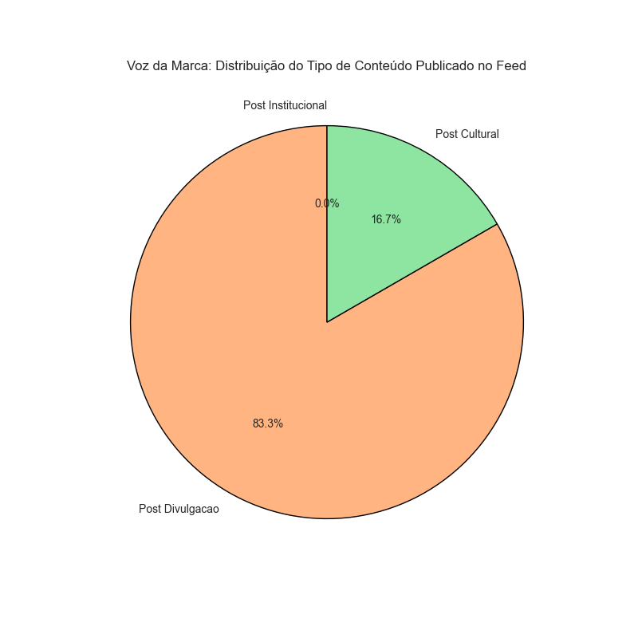
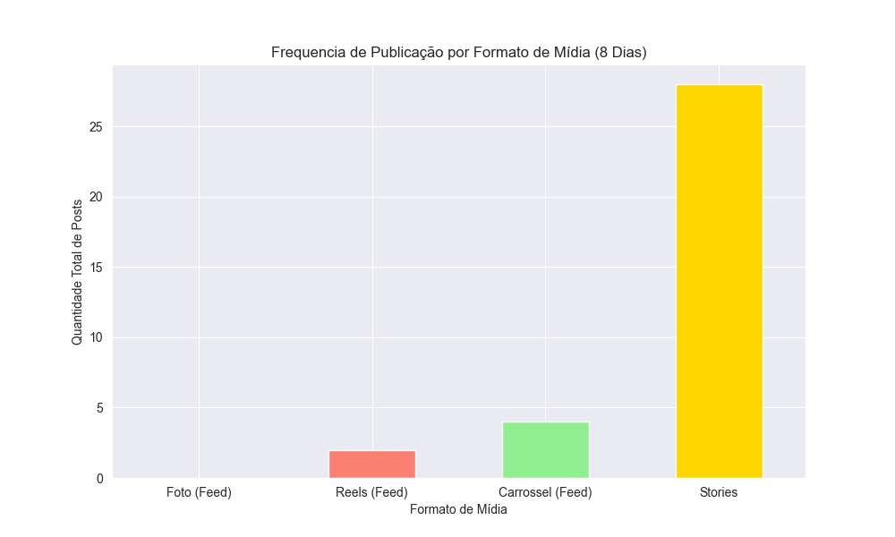
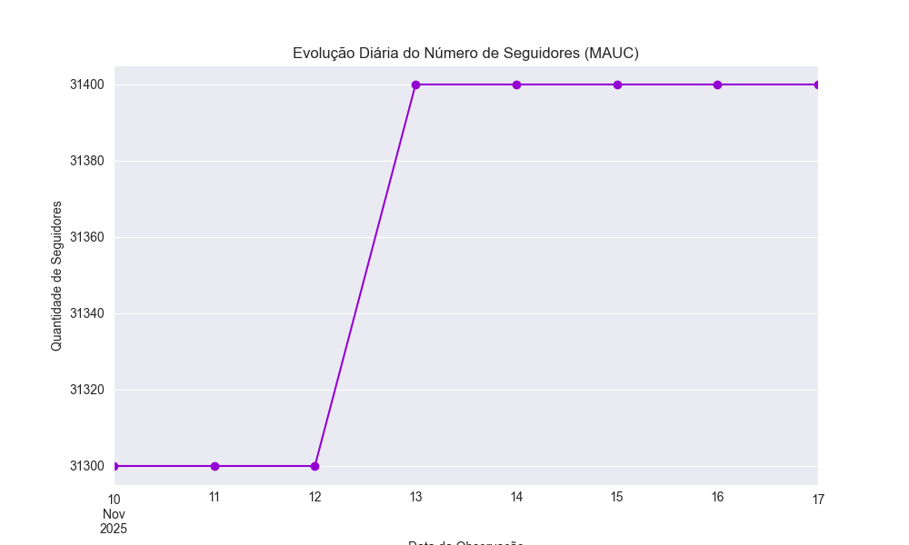

# 🏛️ Análise de Redes Sociais: Museu de Arte da UFC (MAUC)

## 🎯 Objetivo

Projeto desenvolvido como parte da disciplina de Redação para Mídias Digitais. O objetivo principal é realizar uma **Análise de Conteúdo Quantitativa** do perfil do Museu de Arte da UFC (MAUC) no Instagram, correlacionando métricas de frequência e engajamento com as características qualitativas da **Voz da Marca** e atuação na plataforma.

## ⚙️ Metodologia Técnica

* **Objeto de Análise:** Perfil oficial do MAUC (Museu de Arte da UFC) no Instagram.
* **Período de Observação:** 8 dias (10/11/2025 a 17/11/2025).
* **Ferramentas:**
    * **Python:** Linguagem de programação central para manipulação e análise.
    * **Pandas:** Utilizado para ingestão, tratamento e agregação dos dados coletados em *DataFrame*.
    * **Matplotlib/Seaborn:** Utilizados para visualização dos resultados e criação de gráficos (Barras, Linha e Pizza).

**Processo:** Os dados foram coletados manualmente (frequência, likes, comentários, tipo de conteúdo) e transformados em um arquivo CSV para posterior processamento automatizado.

## 📊 Resultados e Conclusões Chave

A análise de 8 dias revelou a estratégia de comunicação do MAUC:

* **Voz da Marca:** Predominantemente **Divulgacional** (83% do conteúdo do *feed*), com foco na conversão (levar o público ao museu) e menos em conteúdo puramente Educacional/Cultural.

* **Frequência:** Atuação **moderada** no *feed* (média de 0.75 posts/dia), compensada por uma **alta frequência** no formato Stories (conteúdo efêmero).

* **Engajamento:** O crescimento de seguidores foi **estável** (+0.32% no período), e a interação ativa da marca (responder/curtir) ocorreu em **37.5% dos dias**, indicando margem para melhoria na comunicação bidirecional.
